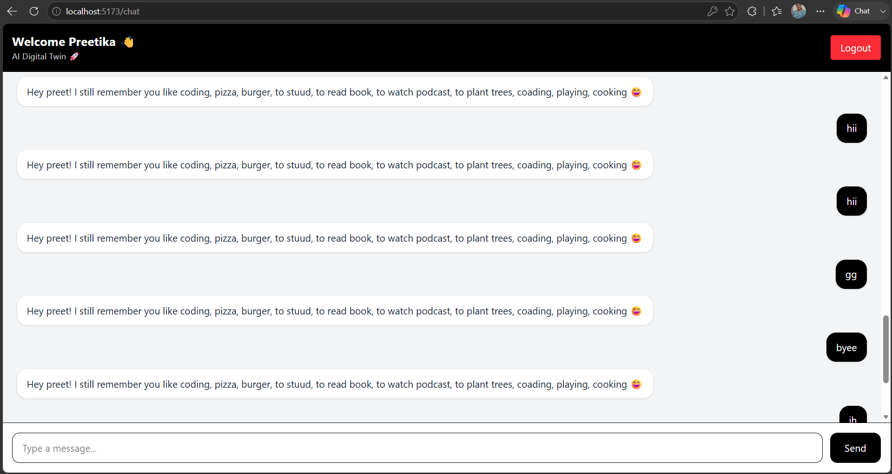
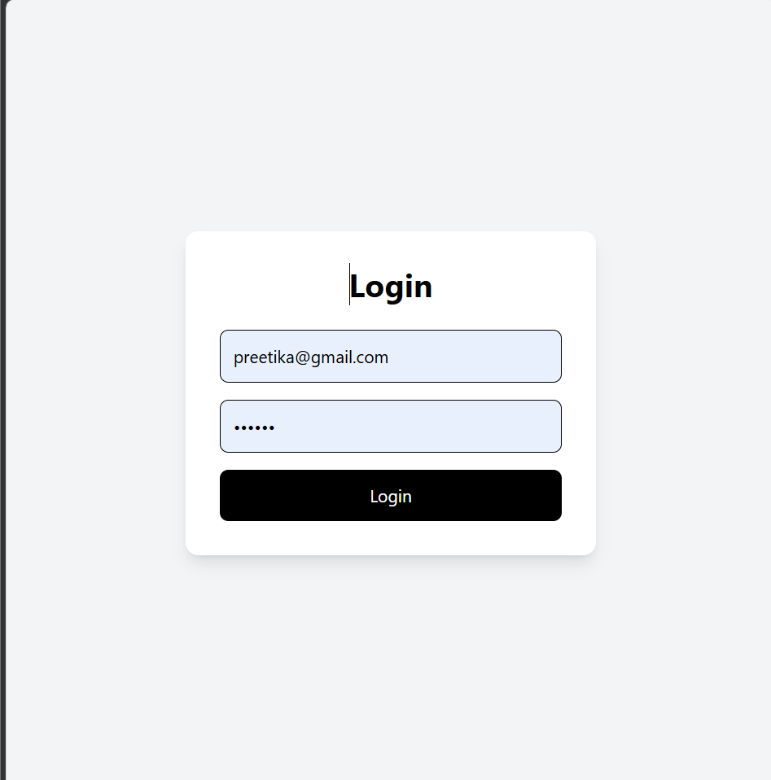

# 🤖 AI Digital Twin (Backend)

A simple AI-like chat backend that remembers user information like name and preferences.

Built step-by-step using:

* Node.js
* Express.js
* MongoDB (Mongoose)
* React.js
* Vite
* Tailwind CSS
* JWT
* OpenAI API

---

## 🚀 Features

* Chat API (`/chat`)
* Stores messages and replies
* Remembers user name
* Remembers user preferences (likes)
* Context-based replies
* User Signup & Login
* JWT Authentication
* Protected Routes
* Chat History
* Typing Indicator
* OpenAI Integration

---

## 🧠 Example

### Input:

```
My name is Preetika
```

### Output:

```
Nice to meet you, Preetika!
```

---

### Input:

```
I like coding
```

### Output:

```
Got it! You like coding 😄
```

---

### Input:

```
Hi
```

### Output:

```
Hey Preetika! I remember you like coding 😄
```

---

## 🛠️ Setup

### 1. Clone repo

```
git clone https://github.com/YOUR_USERNAME/ai-digital-twin.git
cd ai-digital-twin
```

---

### 2. Install dependencies

```
npm install
```

---

### 3. Create `.env` file

```
MONGO_URI=your_mongodb_connection_string
```

---

### 4. Run server

```
node server.js
```

---

## 🌐 API

### POST `/chat`

#### Request:

```json
{
  "message": "Hello"
}
```

#### Response:

```json
{
  "reply": "Hello from AI"
}
```

---

## 📦 Tech Stack

* Node.js
* Express.js
* MongoDB Atlas
* Mongoose

---

## 🚀 Future Improvements

* Multiple memory (array support)
* User-specific memory
* Retrieval Augmented Generation (RAG)
* File upload support
* Vector database integration
* AI Digital Twin personality training
* Chat history context
* Frontend UI

---

## Architecture

User
  ↓
Frontend (React)
  ↓
Express Server
  ↓
MongoDB

---

## Project Structure

ai-digital-twin/
│
├── backend/
│   ├── models/
│   ├── routes/
│   ├── controllers/
│   └── server.js
│
├── frontend/
│   ├── src/
│   └── public/
│
└── README.md

---

## Screenshots

### Chat Interface




### Login




## 👩‍💻 Author

Preetika Gupta
